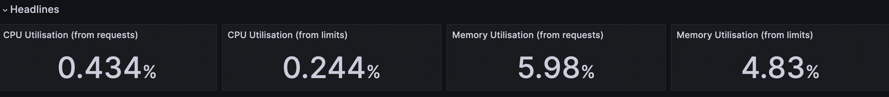

# Grafana Data Retrieval

This code base uses Python and PromQL querying to collect data from PromQL databases about analytics of wifire-quicfire runs.

It collects all of the information that can be found on the [Grafana](https://grafana.nrp-nautilus.io/d/85a562078cdf77779eaa1add43ccec1e/kubernetes-compute-resources-namespace-pods?orgId=1&var-datasource=default&var-cluster=&var-namespace=wifire-quicfire&from=1690454188000&to=1690472188000) website and displays each statistic by Node and Pod, rather than a sum of all pods like Grafana does.

Running main.py will collect and print all information for the header, tables, and graphs.

___

## Data Collected

There are 3 main types of data collected:
1. **Header data**: 
	
    &nbsp; &nbsp; Singular datapoints (per pod) on CPU and Memory Utilization

2. **Tables**: 
	
    &nbsp; &nbsp; Data tables containing several columns of statistics about related topics 

3. **Graphs**:
	
    &nbsp; &nbsp; A table of datapoints containing several times and values per pod that can be displayed with a graph containing several colored lines (one line per pod). Graphs can be displayed by running graph_visualization.py

### Header:

### Table:
  

### Graph:
  

___

## Inputs
There are 4 main inputs (defined in inputs.py) that specify what information will be returned:
1. DEFAULT_DURATION
2. DEFAULT_GRAPH_STEP
3. DEFAULT_GRAPH_TIME_OFFSET
4. DEFAULT_FINAL_GRAPH_TIME

You can also specify specific inputs in the parameters when initializing a class in main.py. Changing these inputs will affect how much data will be returned and from how long ago.
To see how inputs affect a specific query, mess with the settings for that query [here](https://thanos.nrp-nautilus.io/).
Note: There are a couple other inputs used which can be found in [inputs.py](inputs.py)

For more information on the code base, inputs, and all data collected, look at [extras/data_retrieval.pdf](extras/data_retrieval.pdf)

For information on how the queries were originally found, look at these older notes: [extras/queries_notes.md](extras/queries_notes.md)

