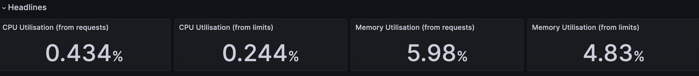
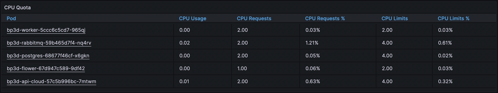
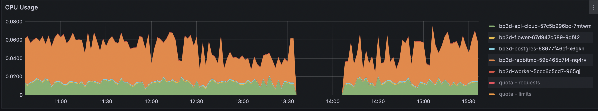

# Grafana Data Retrieval

This code base uses Python and PromQL querying to collect data from PromQL databases about analytics of wifire-quicfire runs.

It collects all of the information that can be found at the following grafana website:
	https://grafana.nrp-nautilus.io/d/85a562078cdf77779eaa1add43ccec1e/kubernetes-compute-resources-namespace-pods?orgId=1&var-datasource=default&var-cluster=&var-namespace=wifire-quicfire&from=1690454188000&to=1690472188000

It displays each statistic by Node and Pod, rather than a sum of all pods like Grafana does.

___

## Data Collected

There are 3 main types of data collected:
1. Header data: 
	Singular datapoints (per pod) on CPU and Memory Utilization

2. Tables: 
	Data tables containing several columns of statistics about related topics 

3. Graphs:
	A table of datapoints containing several times and values per pod that can be displayed with a graph containing several colored lines (one line per pod).

### Header:

### Table:
  

### Graph:
  

___

## Inputs
There are 3 main inputs that specify what information will be returned

